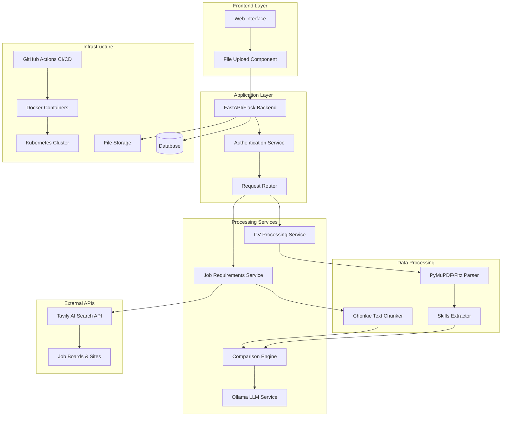

🎯 AI-Career-Mentor: Intelligent CV & Job Matcher
=================================================

AI-Career-Mentor is a cloud-native, AI-powered application that helps users analyze CVs, match them against job requirements, detect skill gaps, and generate personalized learning roadmaps. It combines PDF processing, AI-driven job analysis, intelligent text chunking, and LLM-powered recommendations for a seamless career mentoring experience.

✨ Features
----------

*   **📄 PDF CV Processing** – Extract skills and experience using PyMuPDF (Fitz).
    
*   **🔍 Intelligent Job Search** – Real-time job requirement analysis via Tavily AI.
    
*   **🤖 AI-Powered Analysis** – Advanced comparison using Ollama LLM.
    
*   **📊 Smart Text Processing** – Efficient chunking with Chonkie library.
    
*   **📈 Match Scoring** – CV-job compatibility analysis with actionable insights.
    
*   **🎯 Gap Identification** – Detect missing skills and qualifications.
    
*   **🗺️ Learning Roadmap** – Personalized skill development recommendations.
    
*   **☁️ Cloud-Ready** – Dockerized and Kubernetes-ready for scalable deployments.
    
*   **🔄 CI/CD Pipeline** – Fully automated testing and deployment via GitHub Actions.
    

🏗️ Architecture Overview
-------------------------

🛠️ Tech Stack
--------------

### Application & AI

*   **Backend API** – FastAPI / Flask
    
*   **PDF Parsing** – PyMuPDF (Fitz)
    
*   **Job Analysis** – Tavily API
    
*   **AI Recommendations** – Ollama LLM
    
*   **Text Chunking** – Chonkie
    
*   **Database** – PostgreSQL
    

### Infrastructure & DevOps

*   **Containerization** – Docker
    
*   **Orchestration** – Kubernetes
    
*   **CI/CD Pipeline** – GitHub Actions
    

🚀 Quick Start
--------------

### Local Development

```bash
git clone https://github.com/anaslimem/AI-Career-Mentor.git
cd AI-Career-Mentor
pip install -r requirements.txt
python app.py
```
### Docker Deployment
```bash
docker-compose build
docker-compose up -d
```
### Kubernetes Deployment
```bash
kubectl apply -f k8s/
kubectl get pods -n ai-career-mentor
```

🏛️ Architecture Details
------------------------

*   **Frontend**: Streamlit web app for intuitive CV uploads and interactive dashboards.
    
*   **Backend**: FastAPI application orchestrating CV parsing, job analysis, and AI recommendations.
    
*   **Worker**: Background processing using Redis queues to handle document analysis asynchronously.
    
*   **Database**: PostgreSQL for persistent storage of CVs, jobs, and results.
    
*   **Containerization & Orchestration**: Docker and Kubernetes for scalable, production-ready deployments.
    

🤝 Contributing
---------------

Contributions, issues, and feature requests are welcome!Follow these steps:

1.  Fork the repository
    
2.  Create a feature branch: git checkout -b feature/amazing-feature
    
3.  Commit your changes: git commit -m 'Add some amazing feature'
    
4.  Push to your branch: git push origin feature/amazing-feature
    
5.  Open a Pull Request
    

🙏 Acknowledgments
------------------

*   [PyMuPDF](https://pymupdf.readthedocs.io/) – PDF processing
    
*   [Tavily](https://tavily.com/) – AI-powered job search
    
*   [Ollama](https://ollama.ai/) – Local LLM inference
    
*   [Chonkie](https://github.com/chonkie-ai/chonkie) – Text chunking