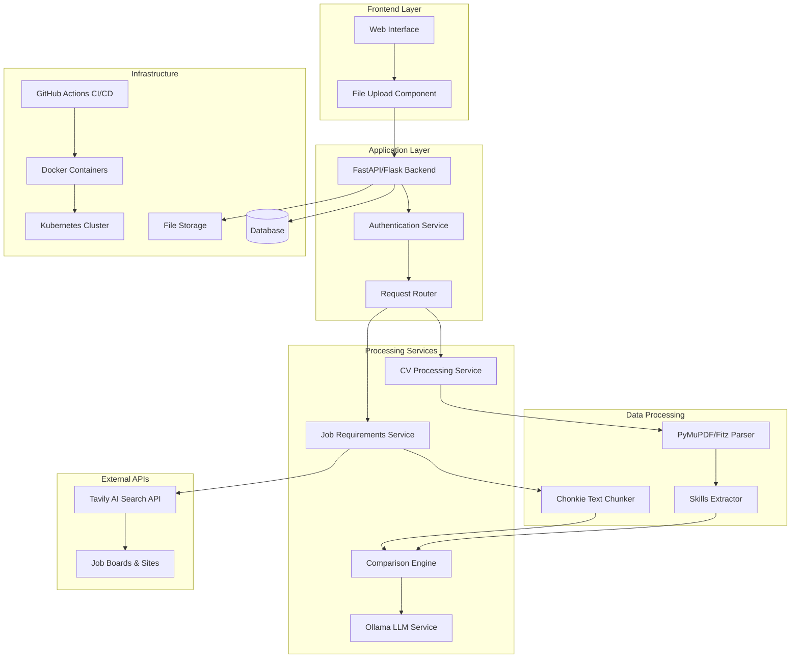

```mermaid
graph TB
    subgraph "Frontend Layer"
        UI[Web Interface]
        Upload[File Upload Component]
    end
    
    subgraph "Application Layer"
        API[FastAPI/Flask Backend]
        Auth[Authentication Service]
        Router[Request Router]
    end
    
    subgraph "Processing Services"
        CVP[CV Processing Service]
        JRS[Job Requirements Service]
        CMP[Comparison Engine]
        LLM[Ollama LLM Service]
    end
    
    subgraph "External APIs"
        Tavily[Tavily AI Search API]
        JobSites[Job Boards & Sites]
    end
    
    subgraph "Data Processing"
        Fitz[PyMuPDF/Fitz Parser]
        Chunkie[Chonkie Text Chunker]
        Skills[Skills Extractor]
    end
    
    subgraph "Infrastructure"
        Docker[Docker Containers]
        K8s[Kubernetes Cluster]
        CI[GitHub Actions CI/CD]
        Storage[File Storage]
        DB[(Database)]
    end
    
    UI --> Upload
    Upload --> API
    API --> Auth
    Auth --> Router
    Router --> CVP
    Router --> JRS
    
    CVP --> Fitz
    Fitz --> Skills
    
    JRS --> Tavily
    Tavily --> JobSites
    JRS --> Chunkie
    
    Skills --> CMP
    Chunkie --> CMP
    CMP --> LLM
    
    API --> Storage
    API --> DB
    
    Docker --> K8s
    CI --> Docker
    
```
